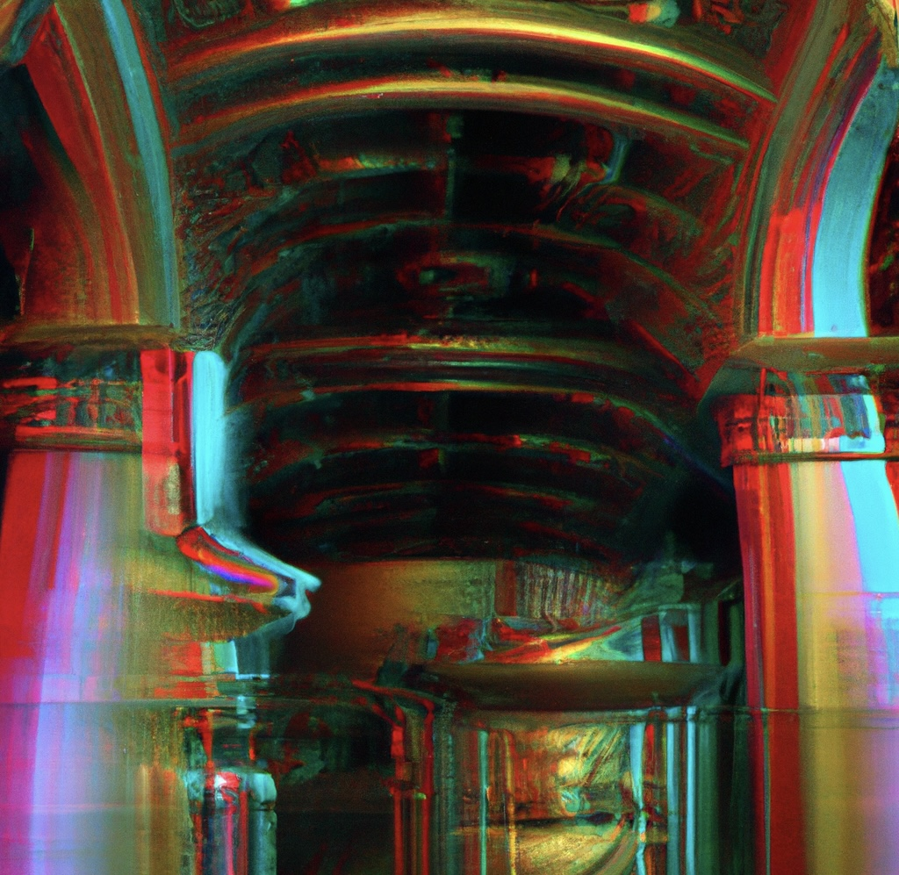

# Kill the VC - Hand Gesture Game

Welcome to Kill the VC, a thrilling hand gesture game where you battle against a fearsome Venture Capitalist (VC) using your very own spaceship! Control your ship and unleash lasers with intuitive hand movements detected via your webcam. Defeat the VC while dodging other enemies to claim victory!



## Features

- **Hand Gesture Control**: Control your spaceship using hand movements captured by your webcam
- **Interactive Menu System**: Easy-to-navigate menu with game options
- **Calibration Tool**: Adjust hand tracking sensitivity to match your environment
- **Multiple Enemies**: Battle against the main VC boss and other enemy ships
- **Score Tracking**: Earn points as you hit enemies and progress through the game
- **Sound Effects**: Immersive audio experience with laser sounds and background music

## Running the Game

You have multiple options to run Kill the VC:

### Option 1: Run the Executable (Easiest)

1. **For macOS Users:**
   - Navigate to the `dist` directory
   - Open the application bundle with:
     ```bash
     open dist/KillTheVC-darwin.app
     ```
   - If you get a security warning, right-click on the app and select "Open"

2. **For Windows Users:**
   - Navigate to the `dist/KillTheVC-windows` directory
   - Double-click on `KillTheVC-windows.exe`
   - If SmartScreen appears, click "More info" and then "Run anyway"

3. **For Linux Users:**
   - Navigate to the `dist/KillTheVC-linux` directory
   - Make the file executable if needed:
     ```bash
     chmod +x KillTheVC-linux
     ```
   - Run the executable:
     ```bash
     ./KillTheVC-linux
     ```

### Option 2: Run with Python

1. **Install Dependencies:**
   ```bash
   pip install -r requirements.txt
   ```

2. **Run the Game:**
   ```bash
   python game.py
   ```

### Option 3: Run with Docker

1. **Install Docker:** Make sure you have Docker and Docker Compose installed on your system.

2. **Set Up X11 Forwarding:**
   - **On Linux:** No additional setup needed.
   - **On macOS:** Install XQuartz, enable "Allow connections from network clients" in XQuartz preferences.
   - **On Windows:** Install an X server like VcXsrv or Xming.

3. **Run the Docker Container:**
   ```bash
   ./run_docker.sh
   ```

## How to Play

1. **Main Menu**: When you start the game, you'll see the main menu with these options:
   - **Play Game**: Start the game immediately
   - **Instructions**: View how to play the game
   - **Calibrate Hand Tracking**: Adjust the sensitivity of hand tracking
   - **Quit**: Exit the game

2. **Calibration:**
   - Use the UP/DOWN arrow keys to adjust the hand tracking sensitivity
   - Higher values make the tracking less sensitive, lower values make it more sensitive
   - Test your hand movements in real-time to find the optimal setting
   - Press ENTER to save your settings and return to the menu

3. **Control the Spaceship:**
   - **Hand Placement:** Position your hand in front of your webcam so it's clearly visible
   - **Movement:** Move your hand to navigate the spaceship across the screen
   - **Firing:** Press the `Spacebar` key to fire a laser

4. **Objective:**
   - **Defeat the VC:** The VC is marked with a subtle red circle and is your primary target
   - **Avoid or Destroy Other Enemies:** Regular enemies give fewer points but are still worth shooting
   - **Health & Score:** Keep an eye on the VC's health bar and your score at the top of the screen

5. **Victory:** The game ends in victory when you successfully destroy the VC (the VC's health reaches zero). A victory message will be displayed with your final score.

6. **Exiting the Game:** To quit the game, press ESC during gameplay or select Quit from the main menu.

## Building from Source

To create your own executable:

1. Install PyInstaller:
   ```bash
   pip install pyinstaller
   ```

2. Run the build script:
   ```bash
   python pyinstaller_build.py
   ```

3. Find the executable in the `dist` directory.

## Project Structure

```
KillTheVc/
├── assets/                # Game assets
│   ├── Assets/            # Images and sound effects
│   │   ├── gringotts.jpg  # Background image
│   │   ├── icon-removebg-preview.png  # Game icon
│   │   ├── laser.png      # Laser image
│   │   ├── Laserpm.wav    # Laser sound effect
│   │   ├── spaceship1-removebg-preview.png  # Player ship
│   │   └── Vc-removebg-preview.png  # Enemy VC image
│   └── sounds/            # Background music
│       └── Joh F.mp4      # Background music file
├── dist/                  # Compiled executables
├── game.py                # Main game code
├── requirements.txt       # Python dependencies
├── setup.py               # Package setup information
├── pyinstaller_build.py   # Build script for executables
├── Dockerfile             # Docker configuration
├── docker-compose.yml     # Docker Compose configuration
└── run_docker.sh          # Script to run the game in Docker
```

## Development

### Prerequisites

- Python 3.7 or later
- Webcam
- Required Python packages (see requirements.txt)

### Contributing

1. Fork the repository
2. Create your feature branch (`git checkout -b feature/amazing-feature`)
3. Commit your changes (`git commit -m 'Add some amazing feature'`)
4. Push to the branch (`git push origin feature/amazing-feature`)
5. Open a Pull Request

## License

This project is licensed under the MIT License. See the `LICENSE` file for details.

## Acknowledgements

This game was developed using the following fantastic libraries:

* **Pygame:** A cross-platform set of Python modules designed for creating games. [https://www.pygame.org/](https://www.pygame.org/)
* **NumPy:** A powerful library for scientific computing and array manipulation. [https://numpy.org/](https://numpy.org/)
* **OpenCV (cv2):** A library for computer vision tasks, including image and video processing. [https://opencv.org/](https://opencv.org/)
* **MediaPipe:** A framework for building multimodal (e.g., video, audio) applied ML pipelines. [https://developers.google.com/mediapipe](https://developers.google.com/mediapipe)

## Author

This game was developed by [iman, Blackboyzeus, Potus] as part of the SensoryLink/Project Thalamus project.

## Contact

If you have any questions or feedback, please open an issue on GitHub or contact the authors directly.

Have fun defeating the VC!
